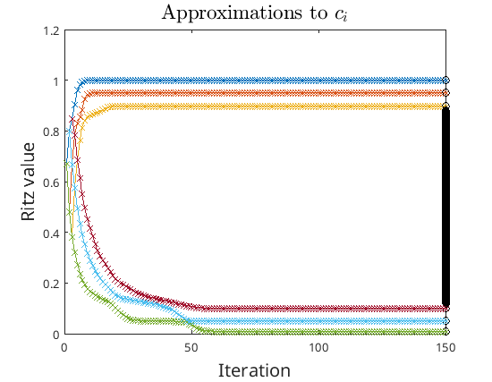
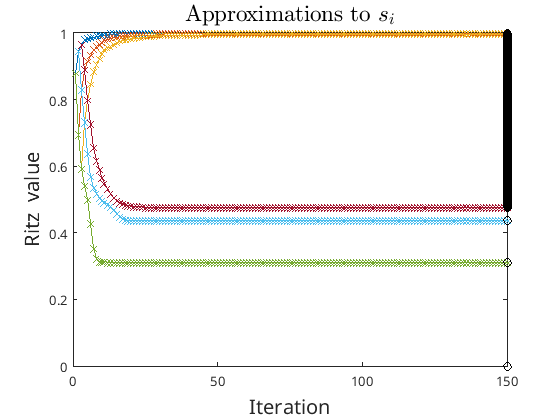
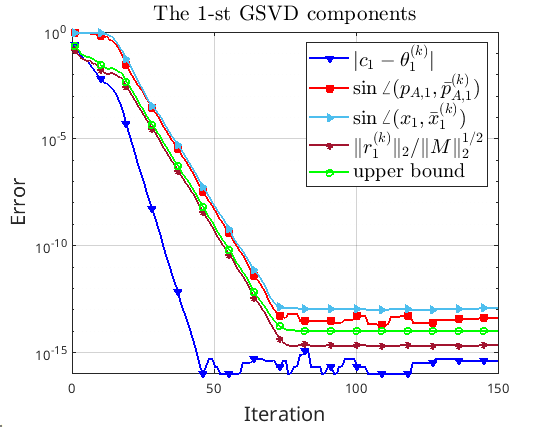
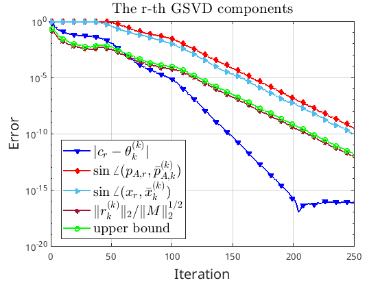

# gsvd_iter

   
 

* gsvd_iter is a MATLAB code library for computing a few Generalized Singular Value Decomposition (GSVD) components of large-scale matrix pairs.

For a matrix pair $\{A,B\}$, if m >= n >= p then the GSVD has the form:
   [ A ] = [ U  0 ]*[ diag(sigma)      0    ]*inv(X)
   [ B ]   [ 0  V ] [      0       eye(n-p) ]
                    [  diag(mu)        0    ]
where
   U  is  m-by-n ,    sigma  is  p-by-1
   V  is  p-by-p ,    mu     is  p-by-1
   X  is  n-by-n .

Otherwise the GSVD has a more complicated form (see the following reference for more details).
 
Reference: C. F. Van Loan, "Computing the CS and the generalized singular value decomposition", Numerische Mathematik, 46 (1985), pp. 479-491. 

## JBD_GSVD. 
 
Compute a partial GSVD iteratively using the joint bidigonalization of $\{A,B\}$. Here are some research papers related to this method.

1. Haibo Li. "[A preconditioned Krylov subspace method for linear inverse problems with general-form Tikhonov regularization](https://arxiv.org/pdf/2308.06577.pdf)."
2. Haibo Li. "[Subspace projection regularization for large-scale Bayesian linear inverse problems](https://arxiv.org/pdf/2310.18618.pdf)."
3. Haibo Li. "[Subspace projection regularization for large-scale Bayesian linear inverse problems](https://arxiv.org/pdf/2310.18618.pdf)."

## gGKB_GSVD. 
 
Compute a partial GSVD iteratively using the generalized Golub-kahan bidiagonalization. Here are some research papers related to this method.

1. Haibo Li. "[A preconditioned Krylov subspace method for linear inverse problems with general-form Tikhonov regularization](https://arxiv.org/pdf/2308.06577.pdf)."

## Submit an issue
You are welcome to submit an issue for any questions related to InverProb_IterSolver. 

## License
If you use this code in any future publications, please cite like this:

Haibo Li. "[A preconditioned Krylov subspace method for linear inverse problems with general-form Tikhonov regularization (https://arxiv.org/pdf/2308.06577.pdf)."

